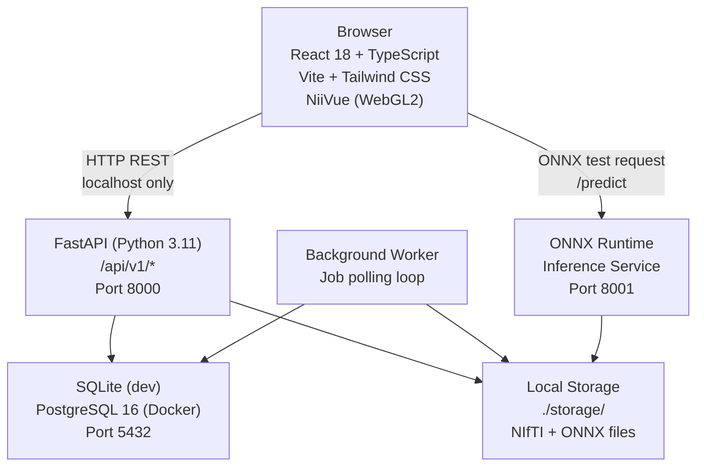
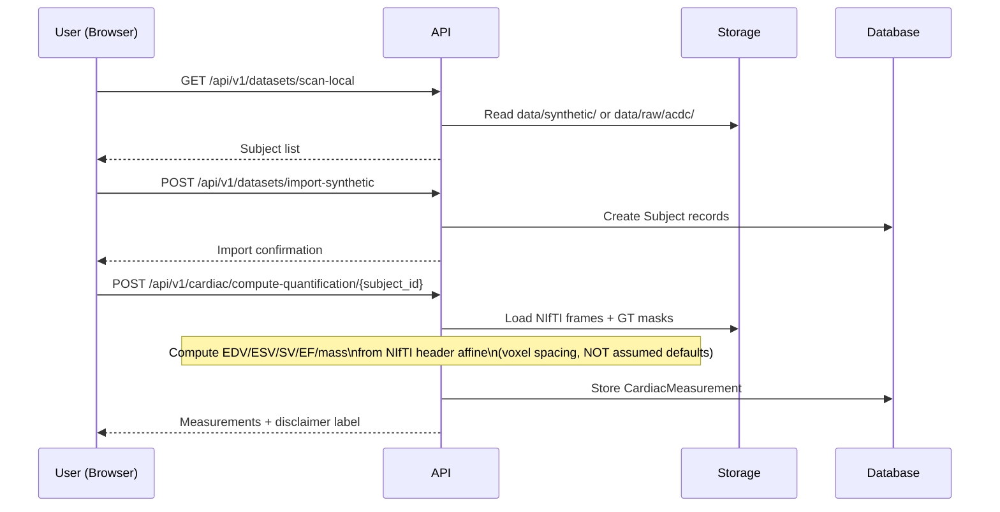
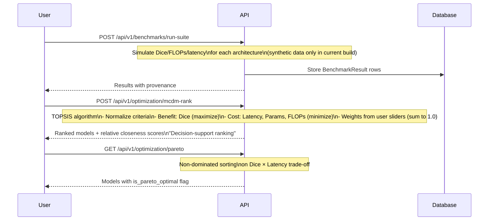
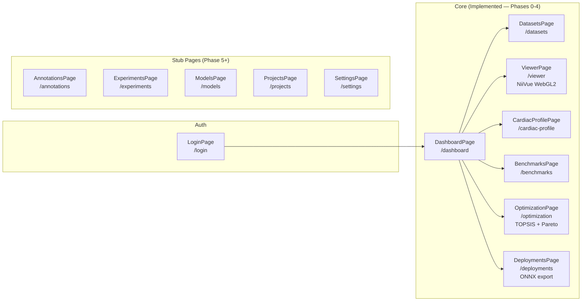
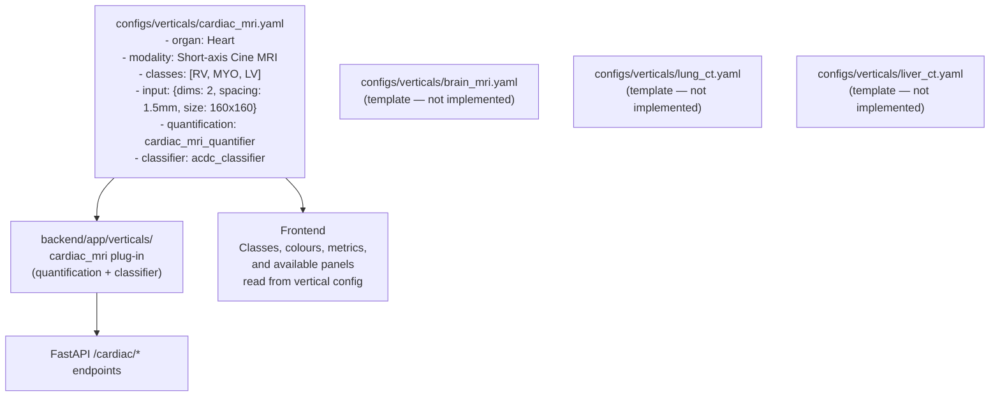
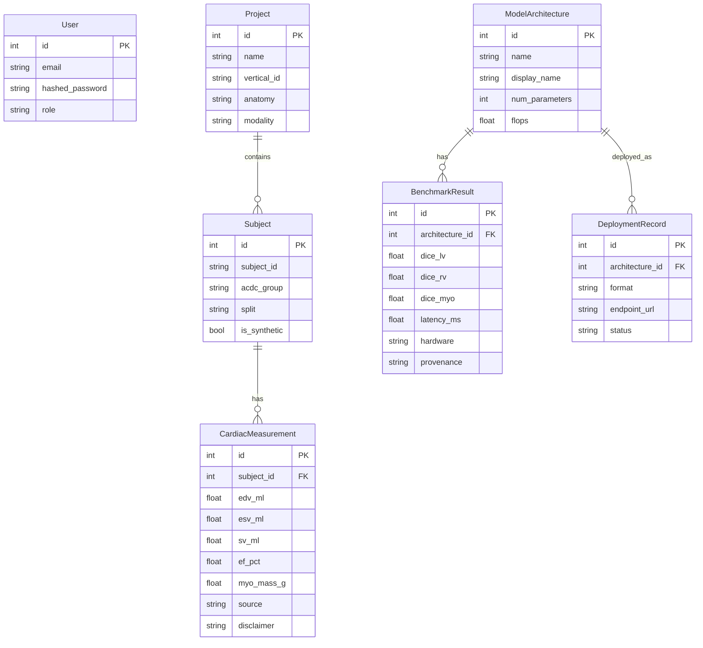

# MedAI Studio — Architecture

> Research prototype — not for clinical use.

---

## Service Architecture

---

## Data Flow — Cardiac Quantification

---

## Data Flow — Benchmark & Optimization

---

## Frontend Page Architecture

---

## Vertical Plug-in Architecture

The system is designed so that new organ/modality verticals can be added by configuration without rewriting generic pages.

---

## Database Schema

Key entities and relationships:

---

## Security Boundaries

- CORS locked to `localhost:3000` and `localhost:5173` (frontend origins only).
- No external API calls at runtime — all inference is local.
- `X-Clinical-Disclaimer` header added to every API response by FastAPI middleware.
- Secrets in `.env` (never committed; `.env.example` shipped).
- `data/`, `storage/`, and trained weights in `.gitignore`.

---

## Key Implementation Decisions

See [`docs/DECISIONS.md`](DECISIONS.md) for full ADRs.

| Decision | Choice | Rationale |
|----------|--------|-----------|
| ADR-001 | NiiVue (WebGL2) as viewer | ACDC is NIfTI-native; OHIF is DICOM-first and poorly suited |
| ADR-002 | Vertical YAML plug-in architecture | New organs by config, not rewrites |
| Cardiac quantification | Affine-derived voxel volumes from NIfTI header | Physical accuracy; never assumed spacing |
| MCDM | TOPSIS | Vectorised NumPy; deterministic; supports mix of benefit/cost criteria |
| Database (dev) | SQLite | Zero-install local dev; same SQLAlchemy 2 ORM for PostgreSQL in Docker |
